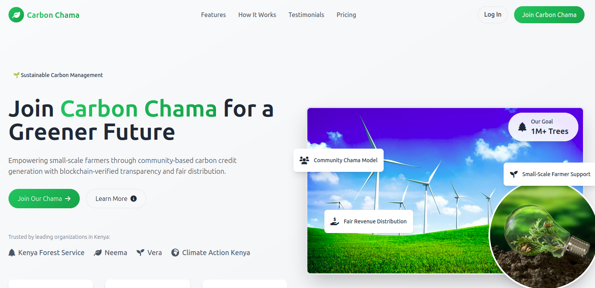

# Carbon Chama

Join Carbon Chama for a Greener Future

Empowering small-scale farmers through community-based carbon credit generation with blockchain-verified transparency and fair distribution.



## Live Demo

Check out the live version of the application at: [https://carbonchama.onrender.com](https://carbonchama.onrender.com)

## Features

- Blockchain-based carbon credit tracking
- Community group management for farmers
- Transparent credit distribution system
- Secure user authentication
- Smart contract integration
- Carbon credit verification

## Tech Stack

- Backend: Go
- Frontend: React
- Database: SQLite
- Blockchain: Smart Contracts
- UI: Tailwind CSS
- Deployment: Render

## Project Structure

- `/backend`: Go backend server with blockchain integration
- `/frontend`:  frontend for farmer interface
- `/contracts`: Smart contract implementations
- `/src`: Additional source code
- `/templates`: Frontend templates
- `/contracts`: Smart contract related code
- `/src`: Additional source code
- `/templates`: Frontend templates

## Getting Started


### Installation

1. Clone the repository
   ```bash
   git clone https://github.com/nyagooh/carbon-chama.git
   cd carbon-chama
   ```
2. Install Go dependencies:
   ```bash
   go mod download
   ```
3. Set up the database:
   ```bash
   go run InitializeDatabase.go
   ```
4. Start the backend server:
   ```bash
   go run main.go
   ```
5. Navigate to the frontend directory and install dependencies:
   ```bash
   cd frontend
   npm install
   ```
6. Start the frontend development server:
   ```bash
   npm start
   ```
3. Set up environment variables
4. Run the application

## Contributing

Contributions are welcome! Please feel free to submit a Pull Request.

## License

This project is licensed under the MIT License - see the LICENSE file for details.
